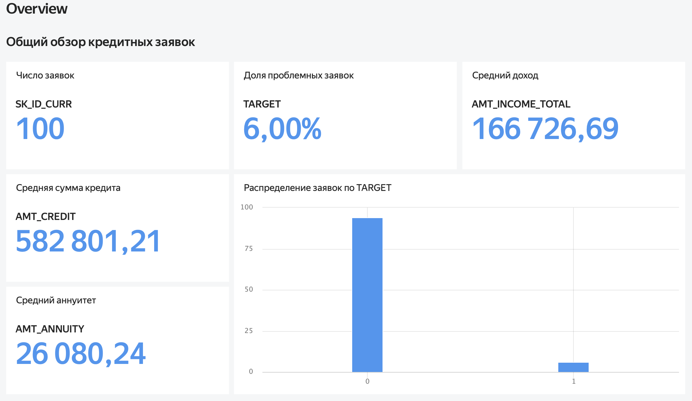
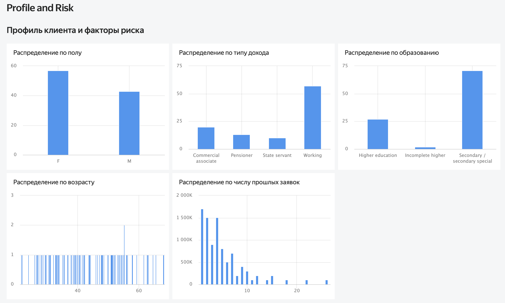
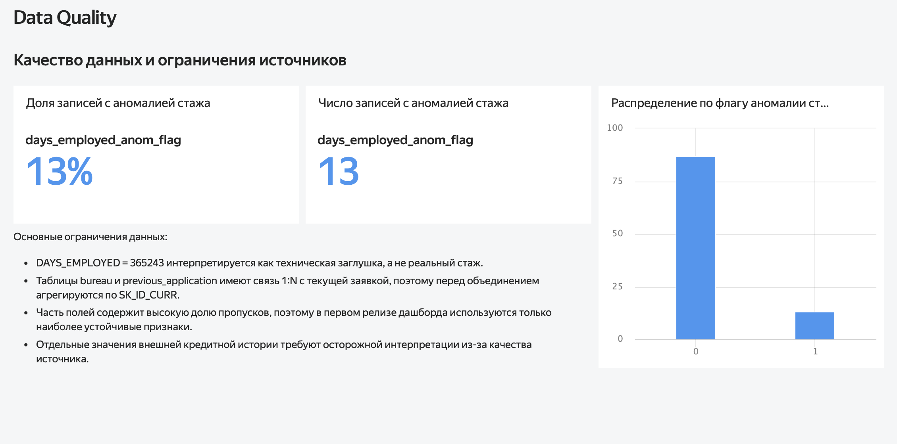

# Credit Applications Data Mart & BI Dashboard

## О проекте
Pet-project по подготовке аналитической витрины и BI-дашборда для анализа кредитных заявок, клиентского профиля, риск-показателей и качества данных.

## Цель
Собрать единый аналитический слой уровня **1 строка = 1 заявка** и подготовить дашборд, который позволяет:
- смотреть ключевые метрики по заявкам;
- анализировать профиль клиентов;
- учитывать внешнюю кредитную историю и историю прошлых заявок;
- отдельно показывать ограничения качества данных.

## Источники данных
В проекте использованы три основных источника:
- `application_train` — текущие заявки;
- `bureau` — внешняя кредитная история;
- `previous_application` — история прошлых заявок.

## Логика сборки витрины
- `application_train` используется как базовая таблица;
- `bureau` и `previous_application` содержат несколько записей на клиента, поэтому перед объединением агрегируются по `SK_ID_CURR`;
- в итоговой витрине каждая строка соответствует одной текущей заявке;
- дополнительно рассчитываются производные признаки и фиксируются правила обработки аномалий и пропусков.

## Что сделано
- собрана аналитическая витрина по кредитным заявкам;
- рассчитаны производные признаки, включая `age_years`, `employment_years`, `credit_income_ratio`, `annuity_income_ratio`;
- добавлены агрегаты по `bureau` и `previous_application`;
- подготовлены:
  - `data_dictionary.md`
  - `calculation_rules.md`
  - `data_quality_notes.md`
- собран BI-дашборд в **Yandex DataLens** из 3 страниц:
  - `Overview`
  - `Profile and Risk`
  - `Data Quality`

## Структура дашборда

### 1. Overview
Общий обзор кредитных заявок:
- число заявок;
- доля проблемных заявок;
- средний доход;
- средняя сумма кредита;
- средний аннуитет;
- распределение заявок по `TARGET`.

### 2. Profile and Risk
Профиль клиента и факторы риска:
- распределение по полу;
- распределение по типу дохода;
- распределение по образованию;
- распределение по возрасту;
- распределение по числу прошлых заявок.

### 3. Data Quality
Качество данных и ограничения источников:
- число записей с аномалией `DAYS_EMPLOYED`;
- доля записей с аномалией;
- распределение по флагу аномалии;
- комментарии по ограничениям данных и логике агрегации.

## Структура проекта
- `data/processed/` - итоговая витрина
- `docs/` - документация по полям, расчетам и качеству данных
- `scripts/` - скрипт сборки витрины
- `screenshots/` - скриншоты дашборда

## Скриншоты

### Overview

### Profile and Risk

### Data Quality

